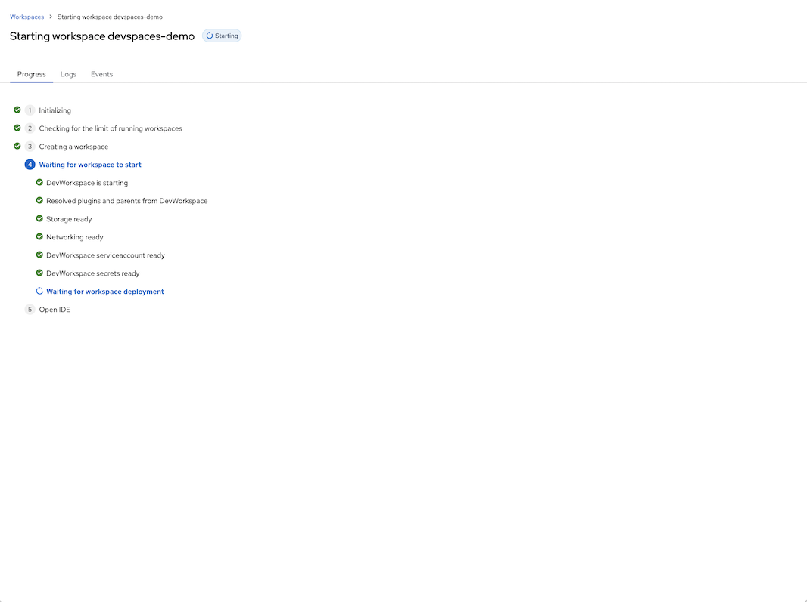
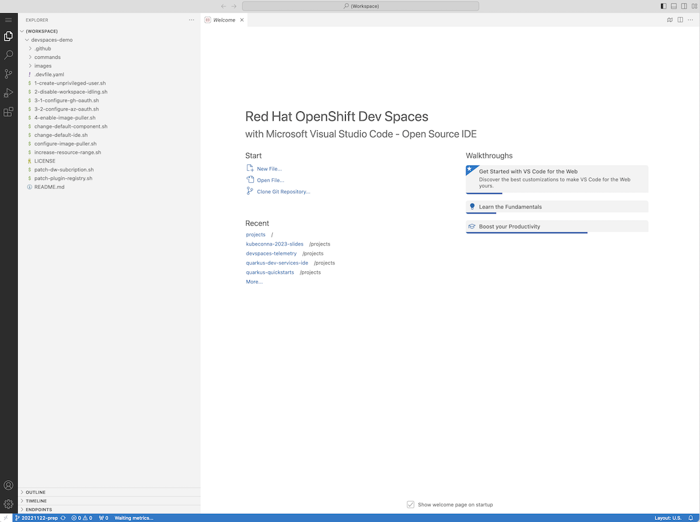
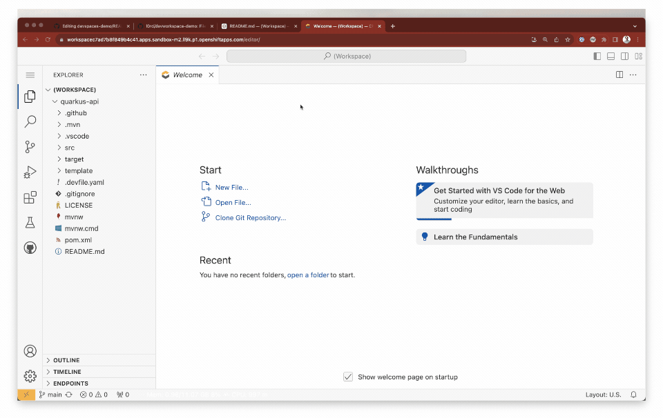
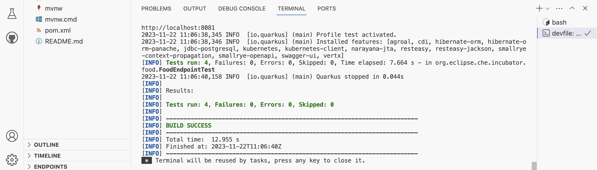

[](https://workspaces.openshift.com/#https://github.com/l0rd/devworkspace-demo)

### [Supporting slides](https://docs.google.com/presentation/d/1ckYOEJTLBla_tcCqspecYOXXnH00FM--VqYlpI-srdk/edit#slide=id.g1288a653e6f_0_147)


# Preparation

### Create a Developer Sandbox Account if you don't have one yet

Follow the instructions on [Red Hat Developer Sandbox web page](https://developers.redhat.com/developer-sandbox) to create an account. This will allow you to start a cloud development environment running this repository.

### Open this repository in a cloud development environment

Click the badge  at the top of this page. After a few seconds you should see VS Code running in your browser with the source code of this repository.

| CDE Startup   |  CDE Running VS Code
:------------------------------:|:--------------------------------------:
 | 

The cloud development environment that you started runs in a container with all the pre-requisties to run this demo. 

<!-- VS Code has some predefined "Devfile" tasks commands that can be used to run this demo steps.

|  Run Tasks Menu  |  Devfile Tasks
:------------------------------:|:--------------------------------------:
 |  -->

### Deploy the editors definitions

The following commands create the `DevWorkspacesTemplates` that contain the IDEs dfinition: `vim`, VisualStudio Code and IntelliJ.

```bash
kubectl apply -f ./editors-contributions/
```

# Iteratively setup a cloud dev environment

## `dw1.yaml` Containerized dev tools and source code with no IDE

Create a cloud development environment using `dw1.yaml` that specify a git repo and a container with the devtools but no IDE:

```yaml
kind: DevWorkspace
apiVersion: workspace.devfile.io/v1alpha2
metadata:
  name: dw
spec:
  started: true
  template:
    projects:
      - name: quarkus-api
        git:
          remotes:
            origin: https://github.com/l0rd/quarkus-api
    components:
      - name: dev-tooling
        container:
          image: quay.io/mloriedo/devtools:latest
EOF
```

To start the cloud development environment, open a Terminal from VS Code (Terminal -> New Terminal) and apply the DevWorkspace custom resource using `kubectl`:

```bash
# Create the CDE
kubectl apply -f dw1.yaml

# Wait for the workspace to be ready
kubectl wait --for=condition=Ready dw/dw --timeout=300s
```

```bash
# Get the cloud development environment Pod name
export POD=`kubectl get pod -l "controller.devfile.io/devworkspace_name=dw" -o jsonpath={.items[].metadata.name}`

# Run the project build (`mvn clen install`) using kubectl exec
kubectl exec -ti ${POD} -- bash -c 'cd ${PROJECT_SOURCE} && mvn clean install'
```

:warning: Last command fails with `exit code 137`: the build process has been killed with an OOM error (Out Of Memory). We are going to fix it in next step

## `dw2.yaml` Add the IDE plus more memory and more CPU

We are going to use a slightly different DevWorkspace object:
```diff
        container:
          image: quay.io/mloriedo/devtools:latest
>           memoryRequest: 2G
>           memoryLimit: 10G
>           cpuRequest: '1'
>           cpuLimit: '4'
>   contributions:
>     - name: editor
>       kubernetes:
>         name: vscode
```

In the same terminal apply the new DevWorkspace custom resource using `kubectl`:

```bash
# Update the CDE
kubectl apply -f dw2.yaml

# Wait for the workspace to be ready
kubectl wait --for=condition=Ready dw/dw --timeout=300s
  
# Retrieve the IDE URL
export IDE=`kubectl get dw dw -o jsonpath={.status.mainUrl}` && \
printf "\nOpen VS Code in your browser with the following link:\n\n\t${IDE}\n\n"
```

Patch the DevWorkspace object to change IDE. Let's use `vim`:

```bash
kubectl patch dw dw \
     --type merge \
     -p '{ "spec": { "contributions": [ {"name": "editor", "kubernetes": { "name": "vim" } } ] } }' && \
  sleep 2 && \
  kubectl wait --for=condition=Ready dw/dw --timeout=300s && \
  export IDE=`kubectl get dw dw -o jsonpath={.status.mainUrl}` && \
  printf "\nOpen VIM in your browser with the following link:\n\n\t${IDE}\n\n"
```

Or IntelliJ...

```bash
kubectl patch dw dw \
     --type merge \
     -p '{ "spec": { "contributions": [ {"name": "editor", "kubernetes": { "name": "intellij" } } ] } }' && \
  sleep 2 && \
  kubectl wait --for=condition=Ready dw/dw --timeout=300s && \
  export IDE=`kubectl get dw dw -o jsonpath={.status.mainUrl}` && \
  printf "\nOpen IntelliJ in your browser with the following link:\n\n\t${IDE}\n\n" 
```

## `dw3.yaml` Preconfigured commands to build and test the application

Next DevWorkspace object specifies some commands `1-package` and `2-runtests`:

```diff
          cpuRequest: '1'
          cpuLimit: '4'
>     commands:
>       - id: 1-package
>         exec:
>           component: dev-tooling
>           commandLine: './mvnw clean package -DskipTests=true -Dquarkus.profile=staging'
>       - id: 2-runtests
>         exec:
>           component: dev-tooling
>           commandLine: './mvnw test'
  contributions:
    - name: editor
```

Use `kubectl` to apply those changes 

```bash
# Update the CDE
kubectl apply -f dw3.yaml

# Restart the CDE to make sure the 
# new commands are passed to VS Code
scripts/dw-restart.sh

# Wait for the workspace to be ready
kubectl wait --for=condition=Ready dw/dw --timeout=300s
```

Now it's possible to run the predefined commands as VS Code tasks (Terminal -> Run Tasks -> devfile)



:warning: Command '2-runtests' fails with the error "org.postgresql.util.PSQLException: Connection to localhost:5432 refused.". We are going to fix it in next step.

## `dw4.yaml` Add a PostgreSQL container to pass tests

Next DevWorkspace object specifies a new component of type container named `postgresql`:

```diff
>       - name: postgresql
>         container:
>           image: 'quay.io/centos7/postgresql-13-centos7@sha256:994f5c622e2913bda1c4a7fa3b0c7e7f75e7caa3ac66ff1ed70ccfe65c40dd75'
>           env:
>             - name: POSTGRESQL_USER
>               value: user
>             - name: POSTGRESQL_PASSWORD
>               value: password
>             - name: POSTGRESQL_DATABASE
>               value: food_db
>             - name: PGDATA
>               value: /tmp/pgdata
```

A PosgreSQL container will be run as a sidecar of the dev tools container in the cloud development environment Pod.

As for other DevWorkspace objects, let's use `kubectl` to apply it:

```bash
# Update the CDE
kubectl apply -f dw4.yaml

# Wait for the workspace to be ready
kubectl wait --for=condition=Ready dw/dw --timeout=300s
```

Now that a postgres container is available, the task `2-runtests` is executed successfully.



# Extra Cloud dev environment configuration

The following extra configurations are optional and are done automatically when using Dev Spaces or Eclipse Che but need to be done manually when applying DevWorkspaces objects manually.

### Mount a `kubeconfig` to access Kubernetes API from the CDE

The following command will create a secret named `kube-config` that will be automatically mounted in `/home/user/.kube/config`.

```bash
$ ./auto-mount/kubeconfig.sh
```

### `bashrc` and `PS1`

The following command creates the `dotfiles-config` ConfigMap and the data of the ConfigMap will be automatically mounted as the file `/home/user/.bashrc.d/ps1.sh`. This will change the prompt (`PS1`) of CDE terminal.

```bash
$ kubectl apply -f ./auto-mount/bashrc.yaml 
```

### `gitconfig`

The following command creates the `git-credentials` Secret that will be mounted as a git credentials file in the CDE. The user won't need to manually login to GitHub to git push.

```bash
export GITHUB_LOGIN="<gh-login>"
export GITHUB_TOKEN="<gh-token>"
export GIT_USER_EMAIL="<email>"
export GIT_USER_NAME="<name>"

$ ./auto-mount/gitconfig.sh
```

### Persist `~/.m2`

TODO

# How to update the dev tools image used in the demo

Build the container image with the devtools defined in the Dockerfile.dev file

```bash
IMAGE="quay.io/mloriedo/devtools"
docker build -t "${IMAGE}" -f Dockerfile.dev .
docker push "${IMAGE}"
```

# How to cleanup all the resources created by this demo

```bash
NAMESPACE=dw-demo
kubectl delete dw dw
kubectl delete cm git-config dotfiles-config
kubectl delete secret git-credentials kube-config
kubectl delete dwt vs-code vscode-ds intellij vim
```
